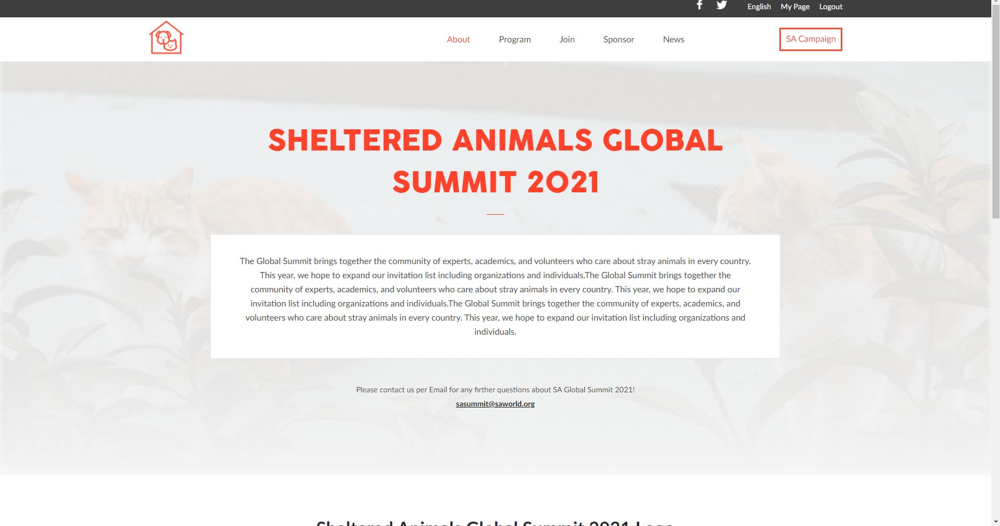

# Sheltered Animals Global Summit

> This is a project made for Capstone Week to complete the first study module. The theme of the project is the Sheltered Animals Global Summit. It's a two-page website with mobile and desktop design versions.

## Built With

- HTML, CSS, JavaScript

## Video about this project

[Click here to watch the video (recorded using Loom)](https://www.loom.com/share/97cdad832e6c4944ba63447d2f9de467)

## Live Demo

[Live Demo Link](https://raw.githack.com/rdnrn/capstone-summit/capstone-project/home.html)

## Getting Started

To get a local copy up and running follow these steps:

1. Click the green "Code" button
2. Click the "Download ZIP" button
3. Open a ZIP folder and open either "home.html" or "about.html" files.

## Author

- GitHub: [@rdnrn](https://github.com/rdnrn)

## 🤝 Contributing

Contributions, issues, and feature requests are welcome!

## Show your support

Give a ⭐️ if you like this project!

## Acknowledgments

- The Author of the used design template: [Cindy Shin](https://www.behance.net/adagio07)
- Design template that was used: [Click here](https://www.behance.net/gallery/29845175/CC-Global-Summit-2015)
- Microverse
- Cartoons about animals

## 📝 License

This project is [MIT](./MIT.md) licensed.
